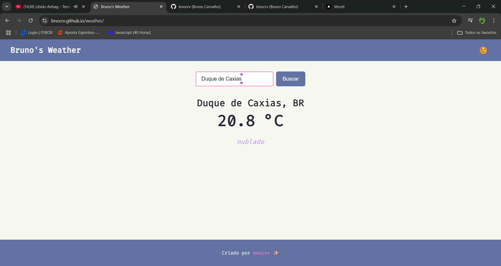

# 🌦️ Bruno's Weather

*Bruno's Weather* é um aplicativo web que exibe a temperatura atual de qualquer cidade informada, utilizando dados em tempo real obtidos através de uma API de clima. Desenvolvido com **HTML**, **CSS** e **JavaScript**, o projeto traz uma interface limpa e funcional, com suporte a **tema claro** e **tema escuro**.

[🔗 Acesse o projeto](https://bnocrv.github.io/weather/)

---

---

# 🧩 Funcionalidades principais

- Busca de temperatura atual por nome da **cidade**
- Exibição dinâmica da **temperatura**, **descrição do clima** e **ícone representativo**
- Alternância entre **tema claro** e **tema escuro**
- Feedback em caso de cidade inválida ou erro na API
- Interface responsiva, adaptada para desktop e mobile
- Dados obtidos em tempo real via **API externa de clima**

---

# 📷 Screenshot

---

# 🧠 Conceitos e tecnologias aplicadas

- HTML5 semântico para estrutura da interface
- CSS3 com uso de variáveis para alternância de temas
- JavaScript para chamadas à API e manipulação do DOM
- `fetch()` para requisições HTTP assíncronas
- Controle de erros em requisições externas
- Design responsivo com foco em usabilidade

---

# 🧪 Melhorias futuras

- Mostrar **sensação térmica**, **umidade** e **velocidade do vento**
- Integração com **geolocalização automática**
- Histórico de pesquisas recentes
- Suporte a múltiplos idiomas
- Animações de transição ao alternar tema ou cidade
- Cache local com `localStorage` para última busca

---

# 👨‍💻 Sobre

Este projeto foi criado como parte dos meus estudos em **Análise e Desenvolvimento de Sistemas (ADS)** e como exercício prático de consumo de APIs públicas, controle de temas e criação de interfaces acessíveis e modernas.

---

# 📫 Contato

- GitHub: [@bnocrv](https://github.com/bnocrv)  
- LinkedIn: [@bnocrv](https://linkedin.com/in/bnocrv)
